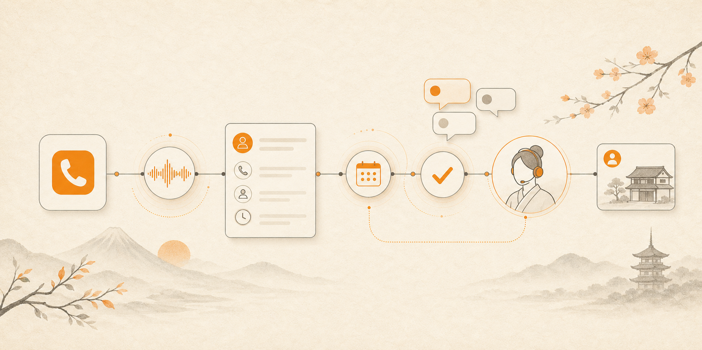
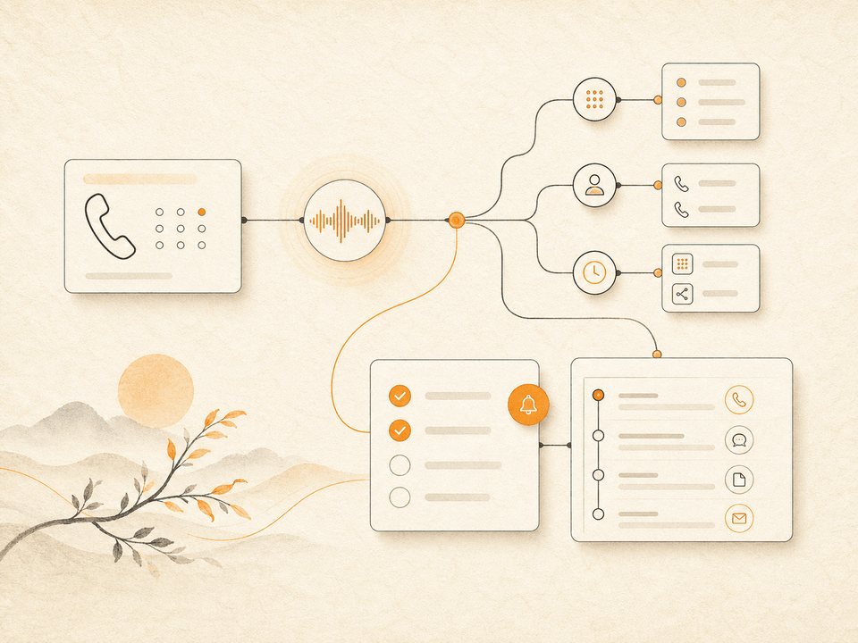

# SGH Japan Assistant Skill

<p align="center">
  
</p>

<p align="center">
  <a href="README.md">日本語</a> ·
  <a href="README.zh-TW.md">繁體中文</a> ·
  <a href="README.en.md">English</a> ·
  <a href="README.ko.md">한국어</a> ·
  <a href="README.tr.md">Türkçe</a>
</p>



> **MVP / Private beta** — 공개 repository와 로컬 Skill은 SGH를 알리고 요청 내용을 준비하기 위한 입구입니다. Remote MCP 실행 도구는 OAuth, 유료 이용 자격, 운영 환경 검증이 끝나기 전에는 정식 서비스로 간주하지 않습니다.

## 그 일본어 전화, 혼자 고민하지 마세요.

**일본에서 필요한 전화, 예약, 확인 요청을 AI로 정리해 SGH에 상담하세요.**

레스토랑 예약, 호텔 문의, 병원 확인, 예약 시간 변경. 일본에서는 웹사이트를 확인한 뒤에도 “전화로 확인해 주세요”라는 마지막 단계가 남아 있는 경우가 많습니다.

`SGH Japan Assistant Skill`은 호환 가능한 AI가 draft를 만들고, 사용자의 명시적 확인을 받은 뒤 진행 상태와 검증된 SGH 결과를 조회할 수 있게 하는 공개 Agent Skill 및 Remote MCP gateway입니다.

[SGH Phone 보기](https://phone.shingihou.com) · [첫 상담 예약](https://calendar.app.google/RF2YRyJifsPzjbDj8) · [문의하기](https://phone.shingihou.com/support/contact)

> [!IMPORTANT]
> **이 repository의 공개, clone 또는 Skill 설치에는 SGH Phone 무료 통화나 무료 대행 서비스가 포함되지 않습니다.**
> SGH의 실제 전화, 예약, 변경, 취소 및 사람의 처리는 유료 서비스입니다. 유효한 계약, 선결제 크레딧 또는 발행자가 비용을 부담하는 해당 서비스용 SGH Pass가 확인되지 않으면 실행 대기열에 들어가지 않습니다.

## 무료 공개 영역과 유료 실행 영역

| 무료 공개·홍보 기능 | SGH 유료 실행 서비스 |
|---|---|
| README, 사례, 공개 문서 열람 | SGH의 외부 전화 |
| 로컬 Skill 설치 | 실제 예약, 변경, 취소 |
| 요청 내용과 상담 메모 정리 | 사람의 검토와 후속 처리 |
| 부작용 없는 기능·적합성 확인 | Twilio, 음성 AI 또는 운영 인력이 필요한 작업 |

## AI에게 이렇게 말해 보세요

```text
“내일 저녁 7시에 이 레스토랑에 두 명 자리가 있는지 문의할 내용을 정리해 줘.”

“이 병원이 외국인 환자를 받는지 확인하는 데 필요한 질문을 준비해 줘.”

“치과 예약을 다음 주로 변경하기 위한 상담 메모를 만들어 줘.”

“호텔에 밤 11시 체크인이 가능한지 문의할 내용을 정리해 줘.”

“일본어로 전화하기 전에 필요한 정보를 먼저 정리해 줘.”
```

Skill은 대상, 목적, 희망 시간, 기한, 공유해도 되는 정보를 정리해 `SGH Consultation Brief`를 생성합니다.

## 왜 이 Skill이 필요한가요?

AI는 정보를 찾는 데 능숙하지만, 일본의 예약과 서비스 문의는 마지막 단계에서 전화가 필요한 경우가 많습니다.

- 일본어로 무엇을 어떻게 말해야 할지 모르겠을 때
- 상대방의 영업시간에 전화하기 어려울 때
- 업체가 물어볼 내용을 미리 준비하고 싶을 때
- 의료, 숙박, 취소 조건처럼 실수하면 안 되는 사항이 있을 때
- 결과를 자신의 언어로 이해하고 싶을 때

SGH는 정보를 찾은 뒤 실제 일본 업체와 조율하기까지의 어려운 구간을 지원하는 데 집중합니다.

## 공개 Skill이 하는 일

1. **요청 이해** — 전화, 예약 확인, 일정 변경, 재통화 등의 목적을 분류합니다.
2. **필수 정보 정리** — 대상, 목적, 시간, 기한, 결과 언어를 확인합니다.
3. **위험 요소 사전 표시** — 의료, 결제, 개인정보, 취소 수수료는 담당자 검토 사항으로 표시합니다.
4. **SGH 상담 메모 생성** — AI 대화를 SGH가 빠르게 검토할 수 있는 형식으로 바꿉니다.
5. **공식 상담 채널 안내** — 준비된 요청을 SGH Phone 공식 상담 창구로 연결합니다.



## 활용 예시

| 분야 | 상담 예시 |
|---|---|
| 레스토랑 | 좌석, 예약 조건, 알레르기 관련 확인 |
| 호텔·여행 | 늦은 체크인, 수하물 보관, 교통편 확인 |
| 병원 | 외국어 대응, 초진 조건, 예약 방법 확인 |
| 미용·생활 서비스 | 예약, 일정 변경, 서비스 조건 확인 |
| 부동산·생활 인프라 | 집 보기, 관리 회사, 전기·가스·인터넷 문의 |
| 기업 업무 | 일본어 전화 접수, 재통화, 예약 전 확인, 후속 대응 |

실제 대응 가능 여부, 비용, 일정, 권한 및 업종별 제한은 정식 상담 후 SGH가 확인합니다.

## 단순한 광고가 아닙니다

이 repository는 SGH의 공개 서비스 입구이면서, 설치한 AI가 실제로 구조화된 상담 메모를 만들 수 있는 실용적인 Skill입니다.

```text
SGH Consultation Brief
- Fit: GOOD_FIT
- Target: Restaurant ABC, Fukuoka
- Goal: 내일 19:00 두 명 예약 가능 여부 확인
- Preferred timing: 19:00, 18:30도 가능
- Deadline: 오늘 17:00까지
- Result language: Korean
- Information approved for sharing: 이름과 인원수
- Missing information: 취소 규정 동의 여부
- Next step: SGH 공식 상담 채널로 메모 제출
```

## 중요 안내

로컬 `SKILL.md`만으로는 전화가 실행되지 않습니다. Remote MCP에서도 draft는 전화를 걸지 않습니다. 유효한 유료 계약, 선결제 크레딧 또는 발행자 부담 SGH Pass를 먼저 검증하고 사용자가 대상, 목적, 공유 정보, 시간과 비용을 명시적으로 승인해야만 실행을 대기열에 넣을 수 있습니다. `QUEUED`나 `CALLING`은 예약 확정을 의미하지 않습니다.

- 이 repository에는 SGH 전화 크레딧이 포함되지 않습니다.
- 유료 자격이 없으면 `ENTITLEMENT_REQUIRED`를 반환하고 전화나 인력 업무를 만들지 않습니다.
- SGH Pass는 범위가 제한된 유료·후원 자격이며 공개 무료 Token이 아닙니다.

- 실제 대응 가능 여부는 SGH가 별도로 확인합니다.
- 가격, 영업시간, 예약 가능 여부, 의료기관 접수 조건을 추측하지 않습니다.
- 의료 진단이나 치료 제안을 제공하지 않습니다.
- 공개 GitHub Issue에 진료 기록, 여권, 카드 정보를 올리지 마세요.
- 개인정보를 전달하기 전에는 사용자의 명확한 동의가 필요합니다.

## 설치

`skills/sgh-japan-assistant` 폴더를 Agent Skills 호환 도구 또는 프로젝트의 skills 디렉터리에 추가하세요.

```text
Use $sgh-japan-assistant to draft a Japan phone request, then ask me to confirm it before SGH queues execution.
```

Skill package: [`skills/sgh-japan-assistant`](skills/sgh-japan-assistant)

## 기업용 서비스

SGH Phone은 일본어 전화 접수, IVR, 통화 기록, 요약, 담당자 알림, 재통화 관리, 예약 전 확인 및 필요한 경우의 관리된 발신 업무를 정리하는 B2B 전화 운영 플랫폼입니다.

- 자사 서비스를 AI Agent가 발견할 수 있게 하고 싶은 기업
- 외국인 고객의 전화·예약 대응을 개선하고 싶은 기업
- 소규모 팀으로도 전화와 후속 대응을 지속하고 싶은 기업

SGH는 기업 도입 상담도 제공합니다.

## Menu Bridge 같은 홍보용 Skill

Menu Bridge는 메뉴, FAQ, 언어 안내와 요청 정리를 무료로 제공하는 `Powered by SGH` 홍보 입구로 사용할 수 있습니다. 실제 전화, 예약, 변경, 취소와 사람의 처리는 SGH 유료 절차로 전환됩니다. 홍보용 Pass를 SGH Phone 크레딧으로 사용할 수 없습니다.

## 오픈소스 라이선스와 서비스 이용은 다릅니다

MIT License는 repository 코드에만 적용됩니다. SGH Phone 통화, 대행, 사람의 서비스, 상표 또는 브랜드 자산 사용 권한은 포함하지 않습니다.

## 공식 링크

- **SGH Phone**: https://phone.shingihou.com
- **첫 상담**: https://calendar.app.google/RF2YRyJifsPzjbDj8
- **문의**: https://phone.shingihou.com/support/contact
- **운영사**: [Shingihou Co., Ltd.](https://shingihou.com)
