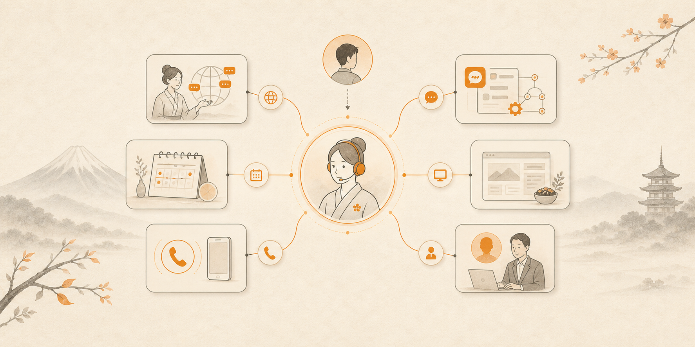
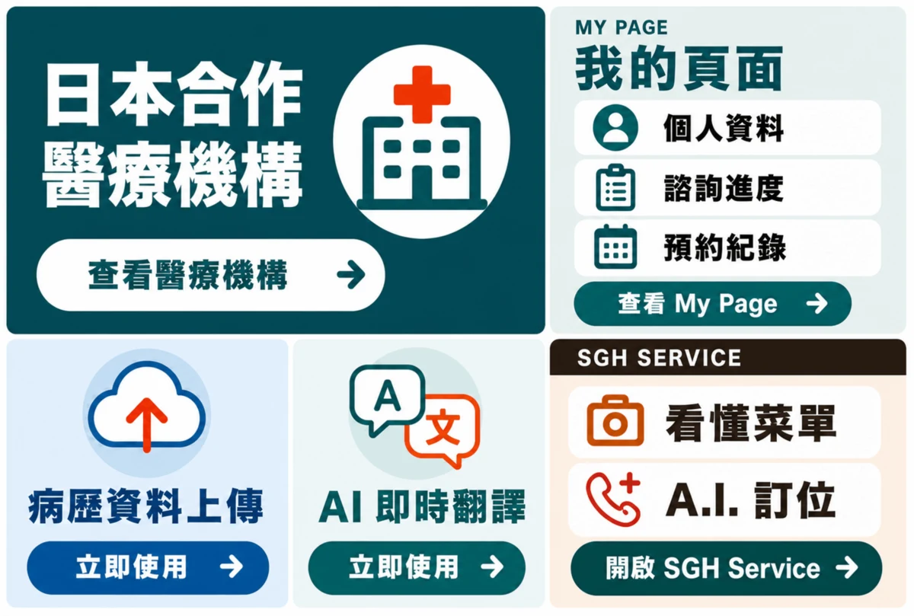
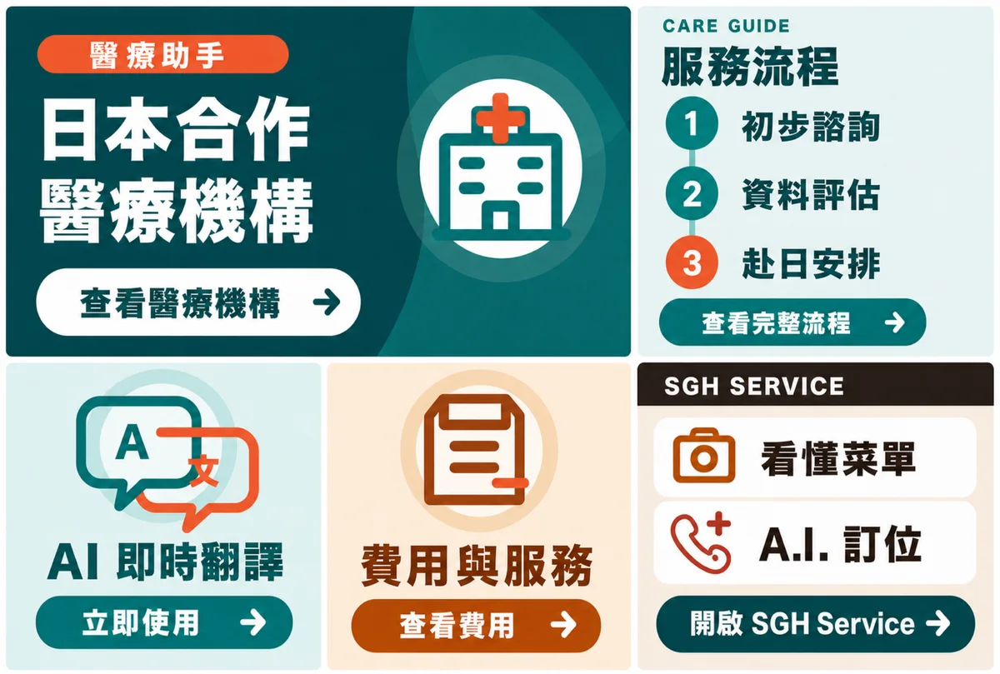
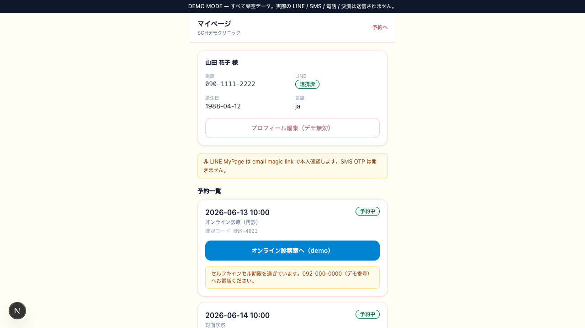
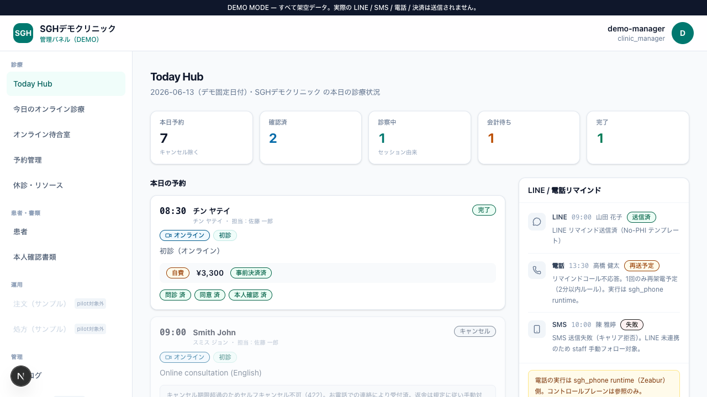

# SGH Japan Assistant

<p align="center">
  
</p>

<p align="center">
  <a href="README.md">日本語</a> ・
  <a href="README.zh-TW.md">繁體中文</a> ・
  <a href="README.en.md">English</a> ・
  <a href="README.ko.md">한국어</a> ・
  <a href="README.tr.md">Türkçe</a>
</p>



> **Public Skill 已開放／Remote execution 為 Private Beta**
>
> 公開 Skill 是協助使用者探索 SGH 服務、整理需求，並前往正確 LINE、Web、工作流程或人工窗口的入口。電話、預約與人工作業屬付費 execution adapter，必須具備使用資格並完成明確確認，安裝 Skill 不會自動啟用。

## 從 LINE 接住需求，讓 AI 找到下一步。

**LINE 承接。AI 整理。連到畫面、人員與工作流程。必要時才付費執行。**

`SGH Japan Assistant` 是新義豊株式會社的官方 Agent Skill。它讓 ChatGPT、Codex、Claude Code 等 AI 能理解並引導使用者前往既有的 LINE Bot／LIFF、Medical Supporter、MS Platform、醫療與跨境支援、Clinic DX、AI 自動化、Web 與日文應對服務。

這不是只會打電話的 Skill。使用者可以先從熟悉的 LINE 入口提出需求，AI 再把模糊內容整理成可行的 Brief，判斷應連到 MyPage、預約頁面、Rich Menu、既有工作流程或負責人。只有確實需要對外電話、預約協調或人工作業時，才進入有報價、有資格驗證、有明確確認的付費執行流程。

[探索 SGH 服務](https://www.shingihou.com/ja/services?utm_source=github&utm_medium=referral&utm_campaign=sgh_skill) ・ [了解 AI 與業務自動化](https://www.shingihou.jp/ai-automation?utm_source=github&utm_medium=referral&utm_campaign=sgh_skill) ・ [企業諮詢](https://www.shingihou.com/ja/contact?utm_source=github&utm_medium=referral&utm_campaign=sgh_skill)

## 60 秒內可以完成的事

- 找出適合自身需求的 SGH 服務與 LINE 入口
- 分辨 Medical Supporter Official LINE、醫療助手 LINE、SGH SERVICE 與 MS Platform 的用途
- 將需求整理成 `SGH Consultation Brief`
- 擬定可寄給日本企業、語氣自然的日文詢問稿
- 盤點 LINE 預約、Rich Menu、LIFF、MyPage、通知與人工交接需求
- 盤點電話、Email、表單、CRM 與 n8n 中的手動作業
- 執行前確認尚缺資訊、費用分類、服務狀態與下一個官方窗口

你可以這樣向 AI 提出需求：

```text
「我第一次在日本看醫生，應該從 Medical Supporter 的哪一個 LINE 入口開始？
  不要收集我的病歷，只告訴我公開入口和準備事項。」

「Medical Supporter Official LINE 和 MS Platform 有什麼不同？」

「我們診所想導入 LINE 預約和 MyPage。
  請製作一份 MS Platform 的 No-PHI 導入 Brief。」

「設計一條從 Rich Menu 到預約、AI 翻譯與人工諮詢的路徑。
  先不要發布 Rich Menu，也不要傳送 LINE 訊息。」

「整理電話、LINE、Email、CRM 裡的手動作業，
  並提出三個可自動化的項目。」

「請把這項需求整理成一頁式 Brief，方便交給 SGH。先不要送出。」

「我想向餐廳確認一些事情。先不要打電話，只整理需要的資訊。」
```

## SGH 已經有可從 LINE 開始使用的服務入口

LINE 不只是通知管道。SGH 已有面向海外患者、醫療支援、服務導覽、AI 翻譯、預約與 MyPage 的 LINE Official Account、Rich Menu 與 LIFF 產品介面。

| LINE／LIFF 入口 | 使用者可以找到什麼 | 目前定位 |
|---|---|---|
| Medical Supporter Official LINE | 日本醫療機構、MyPage、依指示上傳病歷資料、AI 即時翻譯、SGH SERVICE | Rich Menu V6 已確認運用；MyPage 為 MVP／整合中；資料僅能經已認證的正式導線處理 |
| 醫療助手 LINE | 日本醫療機構、依指示上傳病歷資料、AI 即時翻譯、費用與服務、SGH SERVICE | Rich Menu V6 已確認運用；翻譯屬溝通輔助，不取代醫療判斷 |
| SGH SERVICE LINE／LIFF | 由 AI 整理需求，再交給 Web 上的確認、會員與服務申請流程 | 已有實作範例；實際發送、外部 AI、預約與電話須通過認證、契約與費用確認 |
| MenuBridge LIFF | 以相機讀取菜單，並以多語理解內容與點餐條件 | 既有產品介面；AI 用量與提供條件依服務畫面所示 |
| 診所專用 LINE／LIFF | 依醫療機構設定 LINE 預約、MyPage、通知與線上診療入室流程 | MS Platform 公開 mock Demo／產品化 pre-pilot；正式使用須個別導入、tenant 與 LINE 初始設定 |
| LINE Commerce | 商品搜尋、帳號串接、Rich Menu、Webhook、CRM／n8n 串接 | 已有程式與 review 範例；正式啟用須完成外部設定與個別確認 |
| 診所客製 LINE Bot | 組合文字、語音、圖片、多語導覽、預約意圖與人工交接 | Demo／MVP 實作範例；不宣稱已在所有醫療機構運行 |

<table>
  <tr>
    <td width="50%"></td>
    <td width="50%"></td>
  </tr>
  <tr>
    <td align="center"><strong>MEDICAL SUPPORTER</strong><br>MyPage、病歷資料上傳、AI 即時翻譯與 SGH SERVICE</td>
    <td align="center"><strong>醫療助手</strong><br>病歷資料上傳、AI 即時翻譯、費用與服務、SGH SERVICE</td>
  </tr>
</table>

以上為 2026 年 7 月 24 日已儲存至既有 LINE Official Account，並完成六個 URI action 檢查的 Rich Menu V6 實例。這不代表畫面中的每一個後續功能都已全面正式上線；公開 Skill 不接收或上傳醫療資料，也不表示安裝 GitHub Skill 後可免費使用 SGH 的電話、人工或其他付費服務。

[查看 Medical Supporter](https://medicalsupporter.org/?utm_source=github&utm_medium=referral&utm_campaign=sgh_skill) ・ [開啟 Medical Supporter Official LINE](https://line.me/R/ti/p/%40139snanl) ・ [開啟醫療助手 LINE](https://line.me/R/ti/p/%40acl1165c)

## 不是一個萬用 Bot，而是可重複組合的 LINE 實作組合

SGH 能為企業提供的價值，不只是自動回覆訊息。我們設計一條完整路徑：接住詢問、整理必要資訊、由本人確認，再交給已授權的畫面、負責人或系統，並保留後續紀錄。

```text
Discover          LINE intake        Prepare
探索服務       →  接收諮詢與問題   →  AI 分類並整理尚缺資訊
                                             ↓
Track             Human / System     Confirm & Route
追蹤紀錄與進度 ←  負責人／CRM／業務 ←  本人確認內容與條件
```

可依需求組合的實作包括：

- LINE Official Account、LINE Login、LIFF 與 Rich Menu
- FAQ／RAG、多語導覽，以及文字、語音、圖片接收
- 預約、MyPage、通知、商品搜尋與線上診療入口
- Supabase、CRM、行事曆、n8n、付款與人工交接

公開 Skill 只負責解釋這套設計並建立不含機密或患者資料的 Brief。實際 LINE 發送、Rich Menu 發布、患者建立、預約、外部 AI 使用、付款、電話與人工作業，必須在各正式系統內通過認證、權限、費用與明確確認後才能執行。

## MS Platform 是 LINE Bot 後方的醫療機構營運層

Medical Supporter Official LINE 主要建立海外患者與支援服務的接點；MS Platform 則面向醫療機構，逐步整合 LINE 預約、MyPage、就診前狀態、通知、線上診療入室與管理畫面。兩者角色不同，但可以形成同一條患者服務路徑。

<table>
  <tr>
    <td width="50%"></td>
    <td width="50%"></td>
  </tr>
  <tr>
    <td align="center"><strong>患者 MyPage Demo</strong><br>預約內容、確認碼與入室導線</td>
    <td align="center"><strong>醫療機構 Dashboard Demo</strong><br>預約、準備狀態與通知結果</td>
  </tr>
</table>

- 公開 Demo 使用架空資料，不會傳送真實 LINE、SMS、電話或付款。
- 現階段定位為可展示的 mock Demo 與產品化 pre-pilot。LINE 預約、MyPage、通知、線上診療與付款指引，須在醫療機構個別簽約、tenant 設定、審查及外部服務設定後，才可作為 MVP／Pilot 啟用。
- 不宣稱患者問診提交、電子簽名、電子病歷、電子處方箋或線上資格確認等功能已全面正式提供。

[查看 MS Platform](https://ms-platform.shingihou.com/?utm_source=github&utm_medium=referral&utm_campaign=sgh_skill) ・ [開啟公開 Demo](https://ms-platform.shingihou.com/demo?utm_source=github&utm_medium=referral&utm_campaign=sgh_skill)

## 運作方式

```text
LINE / Web            AI                     Route
接住需求          →   整理意圖與限制      →   連到正確畫面／人員／工作流程
                                                   ↓
Track                 Execute                Confirm
追蹤進度與結果    ←   僅在必要時付費執行  ←   確認資格、內容與費用
```

公開 Skill 可以完成探索、整理與導流，不會自動發送 LINE 訊息、發布 Rich Menu、建立患者、上傳病歷、提交預約、撥打電話、付款，或建立人工作業。

## SGH 產品與服務矩陣

| 服務面向 | 公開 Skill 內可完成的事 | SGH 另行提供的事 | 公開狀態 |
|---|---|---|---|
| Medical Supporter／LINE | 整理海外患者支援入口、LINE 可見資訊、準備項目與注意事項 | 與醫療機構聯絡，以及口譯、文件與手續支援 | 官方網站與 LINE 窗口已存在；MyPage 為 MVP／整合中 |
| LINE Bot／LIFF | 將 Rich Menu、FAQ、多語導覽、預約、MyPage 與人工交接設計成 Brief | LINE Official Account、LIFF、Webhook、CRM 串接的設計與建置 | 已有產品實例；個別報價 |
| MenuBridge | 整理菜單、服務資訊、多語內容與導流方式 | 品牌化頁面、LINE／LIFF 整合與個別營運設定 | 宣傳與產品展示入口；依功能適用不同條件 |
| LINE Commerce／診所客製 Bot | 整理商品搜尋、多模態接收、預約意圖與人工交接需求 | 帳號串接、Webhook、外部 AI、CRM／n8n 與正式環境設定 | 程式／Demo／MVP 實例；正式環境個別確認 |
| MS Platform | 整理 LINE 預約、MyPage、本人確認、通知與線上診療入室的導入需求 | tenant 初始設定、需求定義、導入與外部服務串接 | 公開 mock Demo／產品化 pre-pilot；正式使用須個別導入 |
| SGH Phone | 整理電話用途、對象、腳本、分享資訊與營運條件 | AI 接聽、IVR、紀錄、摘要、通知與外撥 | 付費 B2B execution adapter；個別報價 |
| 891 AI Automation | 整理 LINE、Email、表單、CRM 與 n8n 的自動化機會 | 工作流程設計、建置與營運支援 | 開放諮詢中 |
| Web / SNS | 將目標、受眾、導流與內容需求整理成 Brief | 網站製作、營運與社群支援 | 個別諮詢 |
| KusuriJapan | 引導至公開資訊與正式諮詢窗口 | 個別確認進口與相關手續 | 資訊與諮詢服務 |
| SGH Bio Lab | 整理 B2B 用途與諮詢項目 | RUO 相關供應與協調諮詢 | B2B 諮詢 |
| Travel / Dining showcase | 整理菜單、預約條件、行程與確認項目 | MenuBridge 等個別服務、實際預約與電話 | 依功能適用不同條件 |

> [!NOTE]
> 本表是服務探索與定位工具，不保證合約、價格、承接資格或交付時程。Rich Menu 已運用不代表所有後續頁面均已正式上線；Demo／MVP／Pilot 功能也不代表任何醫療機構可在未完成設定前直接使用。

## 提供給個人，以及企業與醫療機構

### 個人／訪日與在日使用者

- 從 Medical Supporter 或醫療助手 LINE 找到合適入口
- 準備日文詢問內容與預約前確認項目
- 了解 MyPage、病歷資料上傳、AI 即時翻譯、費用與海外患者支援窗口
- 以自己的語言理解日文說明
- 在需要付費執行前，先確認費用與分享資訊

### 企業、診所、地方政府與住宿業者

- 電話、LINE、Email、表單與 CRM 彼此分散
- 希望完善外國顧客或患者的接待流程
- 想設計 LINE 預約、Rich Menu、LIFF、MyPage、通知與人工交接
- 想把 MS Platform 導入條件整理成 No-PHI Brief
- 希望自家服務能被 AI Agent 找到
- 想建立自有品牌的官方 Skill、FAQ、LINE Bot 或 MenuBridge

## 輸出範例：SGH Consultation Brief

```text
SGH Consultation Brief

諮詢者類型：診所經營者
目的：整理外國患者的 LINE 詢問與預約前流程
現況：LINE、電話與網站表單分開管理
需求：詢問分類、必要資料確認、MyPage 導流、負責人通知、歷程管理
限制：AI 不進行診斷或治療判斷
可分享資訊：業務流程與已公開的診療說明
不分享資訊：患者姓名、病歷、診斷書
尚缺資訊：每月案件量、支援語言、現行 CRM、LINE 設定、營業時間
候選服務：Medical Supporter LINE + MS Platform + 891 AI Automation
下一步：透過官方諮詢窗口確認需求、導入範圍與報價
```

Skill 可以製作諮詢 Brief，但不會發送 LINE、發布 Rich Menu、建立患者、上傳病歷、送出表單、簽約、打電話、建立預約、付款或變更系統。

## Showcase：讓服務透過 LINE 與 AI 被看見

SGH 不只設計執行功能，也協助企業把服務包裝成「AI Agent 能理解，並能引導至 LINE／Web 正確入口」的產品體驗。

```text
Restaurant ABC MenuBridge — Powered by SGH

探索：菜單、FAQ、店家規則
理解：多語說明、過敏原確認項目
準備：到店條件、預約諮詢 Brief
串接：Rich Menu、LIFF、表單或店家人員
執行：僅透過店家或 SGH 的正式付費流程
```

MenuBridge、公開 FAQ 與服務目錄都能成為吸引使用者的宣傳入口。但瀏覽內容、掃描 QR Code 或取得相關 Token，不會因此獲得 SGH Phone、代訂、人工作業或其他 SGH 服務的免費使用權。

同一套思路也可用於設計：

- 能被 AI Agent 探索的官方 Agent Skill
- LINE Official Account 與 Rich Menu
- LIFF 內的預約、MyPage、表單與會員頁面
- 多語 FAQ、詢問分類與 AI 翻譯輔助
- CRM、行事曆、n8n、負責人通知與人工交接

## 三個官方入口的角色

| 入口 | 角色 |
|---|---|
| [shingihou.com](https://www.shingihou.com/ja) | 公司資訊、正式服務、責任範圍、法務資訊與正式諮詢窗口 |
| [shingihou.jp](https://www.shingihou.jp/) | 多語服務指引、使用案例、Demo 與導入資訊 |
| [SGH-skill](https://github.com/linchichuan/SGH-skill) | 供 AI Agent 探索服務、整理需求並前往正確 LINE／Web／人工入口的公開套件 |

GitHub 並非官方網站的替代品，而是讓服務在 AI 時代被發現的入口。費用、契約、提供條件與個人資料處理方式，應以相關官方網站及個別契約為準。

## 免費公開內容與付費執行服務

| 公開 Skill 包含的內容 | 需要另行簽約或報價的項目 |
|---|---|
| README、服務目錄與公開資料 | 實際發送 LINE 訊息或對外撥打電話 |
| 安裝本機 Skill | 實際預約、變更、取消或患者作業 |
| 服務判斷、諮詢 Brief 與詢問稿 | Rich Menu 發布、LIFF／MS Platform 個別導入 |
| 官方 URL 與下一個窗口指引 | 人工確認、協調與例外處理 |
| 不產生副作用的支援可行性檢查 | 使用 SGH API、通訊、AI 或營運資源的處理 |

> [!IMPORTANT]
> **瀏覽、clone 或安裝此儲存庫的 Skill，不會獲得 SGH 電話、LINE 發送、預約、人工作業、AI API 處理或系統建置的免費額度。**
> 使用者自行使用的 ChatGPT、Claude、Codex 等 AI 服務，其費用與使用條件依使用者與各服務提供商之間的契約而定。

公開工具 `get_sgh_capabilities` 與 `check_task_supported` 只會讀取 MCP gateway 中有版本控管的本機規則，不會呼叫 SGH Service、Supabase、Twilio、LINE Messaging API、外部 AI API 或人工作業佇列，也不會建立 request。

## 公開 Skill 的無副作用邊界

公開 Skill 可以閱讀公開資訊、比較服務、建立 Brief 與提供官方連結，但不會：

- 發送 LINE 訊息或 broadcast
- 建立或發布 Rich Menu
- 登入 LIFF 後代表使用者提交資料
- 建立患者、預約或診療紀錄
- 上傳病歷、診斷書或身分文件
- 啟動視訊診療或通知工作流程
- 撥打電話、扣款或建立人工作業

## Remote MCP：處理電話與一般預約的付費 execution adapter

目前 Remote MCP 並不是能執行 SGH 全部服務的萬用 API。Phase 1 以非緊急電話詢問與一般預約為主，提供草稿、單一 request 報價、使用資格驗證、明確確認、進度與結果查詢。

```text
整理需求                         不打電話
    ↓
透過 OAuth 驗證本人               不打電話
    ↓
確認 request 專屬報價與使用資格   不打電話
    ↓
明確確認對象、分享資訊與費用
    ↓
僅在成功保留可用額度後進入 QUEUED
```

- `DRAFT` — 草稿狀態，尚未撥打電話或建立預約。
- `AWAITING_CONFIRMATION` — 等待補充資訊、報價或確認。
- `QUEUED` — 等待付費執行，不代表預約已完成。
- `CONFIRMED` — 已從對方取得可驗證的確認結果。

SGH Pass 代表已購買，或由發行方負擔費用的使用資格。系統會驗證 tenant、service scope、issuer、期限與使用次數，並以原子方式綁定單一 request。公開用 Token 或 MenuBridge Pass 不得轉用於電話或人工作業。

## 提供狀態

| 項目 | 狀態 |
|---|---|
| Public Agent Skill / README | **Available** |
| 本機服務指引、比較與 Brief 製作 | **Available** |
| Medical Supporter／醫療助手 LINE Rich Menu | **已有運用實例；後續功能依個別條件** |
| Medical Supporter MyPage | **MVP／整合中；不宣稱完整 live** |
| SGH SERVICE LINE／MenuBridge LIFF | **已有實作與既有產品介面；使用條件依功能而異** |
| LINE Commerce／診所客製 Bot | **程式層／Demo／MVP 實例；正式環境須個別確認** |
| MS Platform 公開網站／mock Demo | **Available；使用架空資料** |
| MS Platform 正式 LINE／LIFF 功能 | **產品化 pre-pilot／MVP／Pilot；個別設定後** |
| Remote MCP `/mcp` | **Private beta／尚未驗證 live 環境** |
| 含 OAuth 與計費的正式環境執行 | **正式提供前仍須驗證** |
| 韓文與土耳其文 | README／discovery 文案 |
| API 結果語言 | 日文、繁體中文、英文（Phase 1） |

最後確認日期：**2026-07-24**

## 安裝方式

請將 `skills/sgh-japan-assistant` 加入支援 Agent Skills 的工具或專案 skills 目錄。

```text
Use $sgh-japan-assistant to identify the right SGH LINE, web,
platform, or paid execution service; create a consultation brief;
and show the official next step.
Do not send, publish, create a patient, upload, call, book, or pay.
```

Skill package：[`skills/sgh-japan-assistant`](skills/sgh-japan-assistant)

開發與本機驗證：

```bash
cp env.example .env
npm install
npm run typecheck
npm test
npm run dev
```

- [用戶端連線設定](docs/client-setup.md)
- [系統架構](docs/sgh-skill-architecture.md)
- [免費／付費邊界](docs/commercial-boundary.md)
- [Remote MCP tool contract](skills/sgh-japan-assistant/references/tool-contracts.md)

## GitHub 宣傳素材

- README hero：[`assets/sgh-service-navigator-hero.png`](assets/sgh-service-navigator-hero.png)
- Social preview：[`assets/sgh-service-navigator-social-preview.png`](assets/sgh-service-navigator-social-preview.png)
- Skill icon：[`assets/sgh-icon.svg`](assets/sgh-icon.svg)
- Medical Supporter LINE 實例：[`assets/medical-supporter-line-rich-menu.webp`](assets/medical-supporter-line-rich-menu.webp)
- 醫療助手 LINE 實例：[`assets/medical-assistant-line-rich-menu.webp`](assets/medical-assistant-line-rich-menu.webp)
- MS Platform Demo：[`assets/ms-platform-patient-mypage-demo.png`](assets/ms-platform-patient-mypage-demo.png)／[`assets/ms-platform-admin-dashboard-demo.png`](assets/ms-platform-admin-dashboard-demo.png)

Hero 與 Social preview 圖片內沒有文字，可供五種語言的 README 共用。LINE 圖片為既有 Rich Menu 實例；MS Platform 圖片明確標示為 Demo 並使用架空資料。僅將 Social preview 檔案放入儲存庫，GitHub 不會自動套用；請前往 **Settings → General → Social preview** 手動指定。

## 安全與責任範圍

- 不提供緊急通報、診斷、處方、治療方針或法律判斷。
- 請勿在公開 Skill 輸入症狀、病歷、診斷書、護照、信用卡資料、密碼或驗證碼。
- 不推測或保證空位、是否接待、費用、是否可進口、交期或治療結果。
- 醫療、商品銷售、AI 自動化、LINE、平台與電話服務分別管理簽約主體與責任範圍。
- 不會將 `QUEUED` 或 `CALLING` 描述成「預約完成」。
- 不會在此 repository 儲存 Secret、OAuth Token、LINE／Twilio 憑證或患者資訊。

## 常見問題

### 安裝 Skill 後可以做什麼？

你可以探索 SGH 服務、比較 Medical Supporter LINE 與 MS Platform、整理需求、設計不含患者資料的導入 Brief，並找到正確的 LINE、Web 或人工窗口。僅安裝 Skill 不會傳送、發布或執行任何外部動作。

### 既然已在 GitHub 公開，SGH 服務也是免費的嗎？

不是。MIT License 僅適用於公開程式碼，不包含 SGH 電話、LINE 發送、代訂、人工作業、外部 API 使用、系統導入或商標使用權。

### 電話是這個 Skill 的主要產品嗎？

不是。主要體驗是讓 LINE 接住需求、由 AI 整理，再連到既有畫面、人員與工作流程。電話只是特定任務需要時才啟用的付費 execution adapter。

### Medical Supporter Official LINE 和 MS Platform 是同一個產品嗎？

不是。Medical Supporter Official LINE 是海外患者看見資訊、提出一般諮詢並進入支援服務的接點；其 MyPage 目前為 MVP／整合中。MS Platform 是醫療機構端逐步導入 LINE 預約、MyPage、通知、線上診療入口與管理功能的平台，現有公開 mock Demo，但正式使用需個別導入設定。

### README 裡的 LINE Bot 都可以立刻在正式環境使用嗎？

不可以一概而論。本 README 明確區分正式諮詢入口、已確認運作的 Rich Menu、既有產品介面、公開 mock Demo、MVP 與程式層實作範例。帳號、LIFF、tenant、Webhook、外部 AI、付款、預約及患者相關功能，仍須依個別專案完成契約、設定、審查與測試。

### MenuBridge 是免費電話 Token 嗎？

不是。MenuBridge 是資訊探索、服務展示與導流的產品入口。其使用條件依個別服務而定，不會轉換為 SGH Phone 或人工作業的免費額度。

### 可以把患者資料貼給 Skill，請它直接建立預約嗎？

不可以。公開 Skill 不建立患者、不上傳病歷，也不代表使用者送出醫療或預約資料。請透過正式且完成設定的服務入口處理必要資料。

## 法務與費用

正式提供前審查使用的費用、取消、使用條款、隱私與合理使用政策文件，整理於 [docs/legal](docs/legal/README.md)。目前內容包含尚未生效的草案。實際簽約時，以公開 URL 所刊載的最新版、各 request 的確認畫面及個別契約為準。

## 官方連結

- [新義豊株式會社](https://www.shingihou.com/ja)
- [服務一覽](https://www.shingihou.com/ja/services)
- [多語服務指引](https://www.shingihou.jp/)
- [Medical Supporter](https://medicalsupporter.org/)
- [MS Platform](https://ms-platform.shingihou.com/)
- [SGH Phone](https://phone.shingihou.com/)
- [KusuriJapan](https://kusurijapan.com/)
- [聯絡我們](https://www.shingihou.com/ja/contact)

---

<p align="center">
  <strong>LINE receives. AI structures. SGH routes.</strong><br>
  SGH Japan Assistant — Powered by Shingihou
</p>
